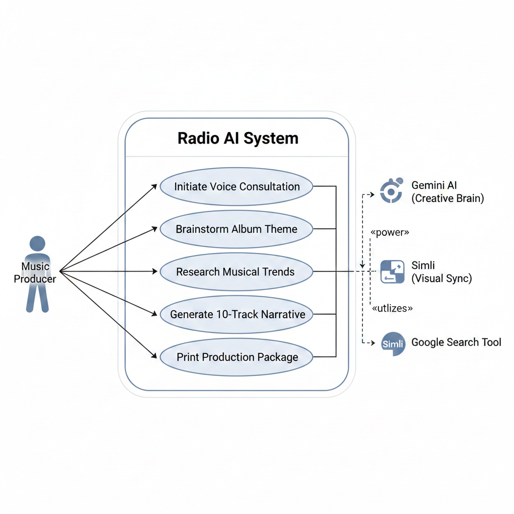
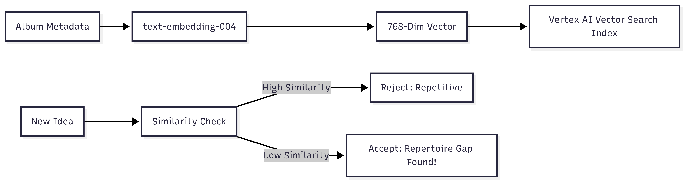

# Lead Creative Producer for Radio AI
SimliGemini - Interactive AI Simli Avatar with Gemini Live

Use cases:


Architecture diagram:


Similarity check, gap analysis:


```mermaid
graph TD
    subgraph "Frontend: Radio AI Studio"
        A[Creator UI / Studio View] --> B[Lead Creative Producer - Gemini Live]
        C[Listener UI / Radio View] --> B
    end

    subgraph "Memory & Intelligence Engine"
        B <-->|get_recent_concepts| D[(Local SQL: Recent History)]
        B <-->|search_repertoire| E[Vertex AI Vector Search Endpoint]
        E --- F[gs://radio-ai/album-similarities]
        B <-->|Google Search Tool| G[Real-time Market Trends]
    end

    subgraph "Production Last Mile"
        B -->|JSON Package| H[Suno API: Audio Gen]
        B -->|Puppeteer Session| I[DistroKid: Global Release]
    end

    subgraph "Multimodal Output"
        B -->|24kHz Native| J[High-Fidelity Audio]
        B -->|16kHz Sync| K[Simli Avatar: Lip-Sync]
    end

SimliGemini is a React application that integrates [Simli's](https://www.simli.com/) real-time AI avatar video generation with Google's [Gemini Live API](https://ai.google.dev/) to create an interactive, conversational AI experience. It part of larger project (Radio AI).

The application features a persona named **Alisa**, a creative producer for "Radio AI," who helps users brainstorm innovative musical album concepts.

## Features

-   **Real-time AI Avatar**: Uses Simli to render a lip-synced, expressive avatar in real-time.
-   **models/gemini-2.5-flash-native-audio-latest Integration**: Connects to Google's Gemini Live API via WebSocket for low-latency, multimodal (audio/text) conversations.
-   **Voice Interaction**: Speak directly to the avatar using your microphone.
-   **Text Chat Fallback**: Type messages if you prefer not to speak.
-   **Visual Feedback**: Real-time audio visualizers for both user input and AI output.
-   **Chat History**: View the conversation transcript.
-   **Controls**:
    -   Microphone Mute/Unmute
    -   Audio Output Mute/Unmute
    -   Volume Control
    -   Download Chat History

## Prerequisites

-   **Node.js**: Ensure you have Node.js installed (v18+ recommended).
-   **Simli Account**: You need a Simli API Key and a Face ID.
-   **Google AI Studio Account**: You need a Gemini API Key.

## Setup

1.  **Clone the repository:**
    ```bash
    git clone <repository-url>
    cd SimliGemini
    ```

2.  **Install dependencies:**
    ```bash
    npm install
    ```

3.  **Configure Environment Variables:**
    Create a `.env` file in the root directory (you can copy `.env.example`):
    ```bash
    cp .env.example .env
    ```
    
    Fill in your API keys in the `.env` file:
    ```env
    # Google Gemini API Key
    VITE_GEMINI_API_KEY="your_gemini_api_key_here"

    # Simli API Key
    VITE_SIMLI_API_KEY="your_simli_api_key_here"

    # Simli Face ID (The ID of the avatar face you want to use)
    VITE_SIMLI_FACE_ID="your_simli_face_id_here"
    ```

## Running the Application

1.  **Start the development server:**
    ```bash
    npm run dev
    ```

2.  **Open in Browser:**
    Navigate to `http://localhost:5173` (or the port shown in your terminal).

3.  **Start the Interaction:**
    Click the "Click to Start" overlay to initialize the Simli client and audio context.

## Usage & Controls

-   **Start/Stop**: The application requires a user interaction (click) to start audio/video.
-   **Microphone**: Click the microphone icon 🎤 to mute/unmute your input.
-   **Speaker**: Click the speaker icon 🔊 to mute/unmute the avatar's audio.
-   **Volume**: Use the slider next to the speaker icon to adjust volume.
-   **Text Input**: Type in the box at the bottom and press Enter to send a text message instead of speaking.
-   **Transcript**: The chat history is displayed on the right side (on larger screens) or can be toggled.

## Project Structure

-   `src/App.tsx`: Main entry point.
-   `src/components/SimliLiveGemini.tsx`: Core component handling Simli client initialization, Gemini WebSocket connection, and audio processing.
-   `public/pcm-processor.js`: AudioWorklet processor for handling raw PCM audio data.
-   `vite.config.ts`: Vite configuration.

## Troubleshooting

-   **Audio Issues**: Ensure your browser has permission to access the microphone.
-   **Connection Errors**: Check your API keys in the `.env` file and ensure they are valid.
-   **Simli/Gemini Errors**: Open the browser's developer console (F12) to see detailed error messages from the WebSocket or API calls.
